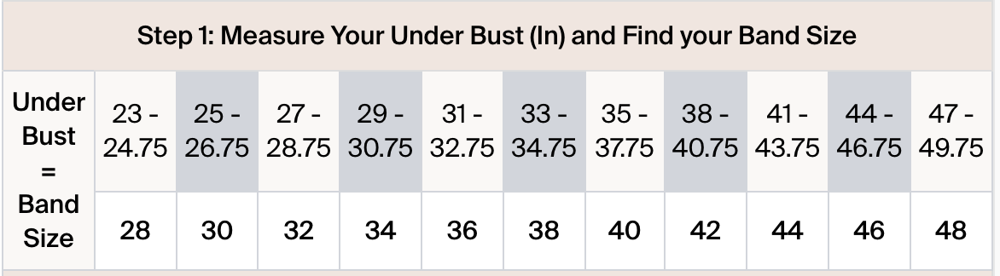

我从小就特别讨厌穿bra，包括但不限于：没有后扣的小背心bra、所有钢圈bra、所有push up bra、所有背后交叉扣的运动bra，尽管为了运动还是每天在穿，但80%时间扣子都是松开的。我一直以为！！穿bra胸闷是我自己的问题……后来发现ASD/ADHD感官敏感有更高概率胸闷气短，更加以为自己就是不适合穿bra的人。两年前，在knix买了件打折的bra特别、无比舒服，最近因为磨损开始考虑回购后，却买了好几件类似的都不满意。

前几天晚上在reddit的r/ABraThatFits刷到了这个subreddit著名的计算器，计算你真正的bra尺寸，[链接](https://abrathatfits.org/calculator.php)无聊就测了，测完后大为震惊，我原来穿的尺寸是75A/B或者32A/B或者s，但这里测出来我竟然是……28F！！过于震撼的我开始回忆&查找“标准”尺寸的历史，就此发现了这座让不知道多少女的买不到舒适bra穿的屎山代码。

## 北美&亚洲尺寸计算方法

_此处指官网size chart/尺码表给出的测量方法_

### 北美：

用英寸测出上胸围（bust）和下胸围（underbust），给下胸围的数字+4就是底围的数字，再用上胸围减去这个数字就是罩杯。比如我的下胸围是28 inch，上胸围是34 inch，则底围应该选择28+4 = 32，而罩杯应该选择34 - 32 = 2 英寸差值，也就是B罩杯。如果差值是一英寸就是A，三英寸就是C，四英寸就是D，以此类推。

### 亚洲：

用厘米测出上胸围和下胸围，上下胸围的差值10cm = A，12.5cm = B，15cm = C，以此类推。

聪明的读者一定发现了，这里的差值为什么是从10cm/4 inch开始计算的呢？那小胸差值不到这个数字怎么办呢？呵呵这里就要讲到bra尺寸最开始的创立导致的屎山了。

## 历史遗留问题

1932年，S.H. Camp and Company创造了bra尺寸系统，最*原教旨*的计算方法是直接用上胸围减去下胸围，差值1英寸为A，2英寸为B……但当时的bra面料多用没有弹性的棉，因为合成材料如聚酯纤维/elastine/nylon等弹性面料尚未发明或广泛应用，如果70cm底围就买70cm长的bra，会导致呼吸困难。所以才有了所谓的+4 rule，也就是虽然下胸围是70cm/28 inch，厂商却要求你在此之上加上4英寸挑选80cm/32 inch的底围，从而解决了下胸被卡死的问题。

同时，罩杯的定义一直没有改变，A罩杯的bra最宽部分的维度永远是比底围多1英寸/2.5cm，也就是说，直到今天，70b/28b的上胸围，仍然是70+5cm=75cm，28+2inch=30inch。

本来这个规则是约定俗成防止穿bra喘不过气的问题，但是时代变化面料科技发展之后，现在显然很少有bra用纯棉这种完全没有任何弹性的面料做了，哪怕97%的棉，加入3%左右的elastine/spandex之后也会具有很大的弹性（这也是现代牛仔裤的做法）。所以，现代的bra已经没必要在真实下胸围上+4inch选底围了，实际上大部分现代厂商的bra，**32的底围并不是真的32inch，32底围实际只有28 inch/70cm！！** 也就是说，在不需要+4 rule后，厂商并没有彻底抛弃这个规则，而是……给底围反向减去了4 inch。所以，你在欧美品牌的商标上有时可以看到32/70这样的标注（比如我手里的la vien en rose），在knix的尺码表上，是这样的：

这就引出了第二个问题：现代面料不再需要放大底围购买bra了，但罩杯怎么办呢，现在32B的bra能容纳34的上胸围吗？

答案是：**不行**。

**A罩杯的上胸围还是只比实际底围大1英寸**。

**B罩杯的上胸围还是只比实际底围大2英寸**。

**C罩杯的上胸围还是只比实际底围大3英寸**。

问出这个答案的时候我真的深深抓狂了。也就是说，在底围可以更紧密包裹下胸、更舒适适应人体之后，测量方式！却没有改进！

所以，当你选了32B的bra后，这件bra的实际尺寸是：底围28 inch，上胸围30 inch；但厂商告诉你的是，如果你的上胸围是34inch，你应该穿32B。也就是说，大多数人的罩杯都被大大低估了。当我试图把34inch的胸塞进30inch的bra时，就算有弹性面料，我的胸仍然被*紧紧地挤作一团*，_从旁边漏出来_。

## 挑选

话说到这里，其实我想rant的内容已经差不多写完了，但现代bra尺寸系统的drama还没有完。一些品牌逐渐开始用真实底围作为尺寸，比如加拿大牌子montelle，就会出现28底围的bra；一些品牌更加偷懒，用弹性面料就直接跳过了上下胸围，开始用s/m/l号（是何异于一条裤子不给臀围不给长度不给前后浪尺寸，写着95-100斤选s码的淘宝女装？），所以我依旧不知道，我到底该怎么挑？我怎么知道品牌用的是真实底围，还是数字+4但我实际底围要-4的方法？

所以，最好的方法或许还是，拿一条卷尺去实体店，找到适合自己真实下底围的尺寸；而罩杯则直接使用上下底围差的方法，无需任何加减，差1英寸就是A，差4英寸就是D，差6英寸就是F……！今天按照这个方法去维秘试了32DD的bra后，竟然感到如此舒适。也就是说，我之前十几年对bra的痛恨，都只是因为穿错了尺寸？哈哈。回到开头我最喜欢的knix bra，也是因为没有具体的分码而是买了s，所以竟然意外地买到了比70b更适合我的尺寸。
